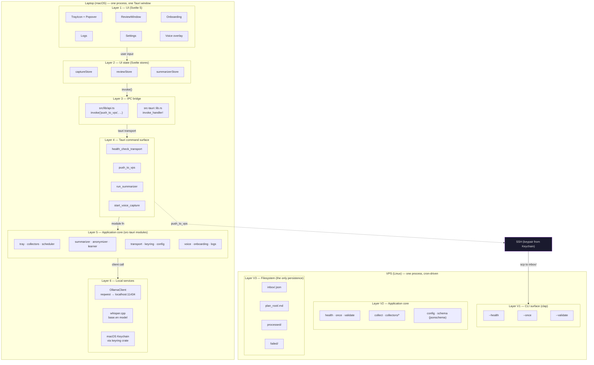

# Architecture

Trail is a single-user daily-capture tool that lives on two machines: a macOS laptop
running a Tauri 2 tray-icon app with auto-pop windows, and a Linux VPS running a small Rust collector. The
two halves communicate over SSH with a keypair stored in the macOS Keychain. All
summarization happens on the laptop; only the user-approved JSON crosses the network.

This document is the canonical design overview. For the threat-model controls, see
[`security.md`](security.md). For the release process, see the
[release-drafter config](../.github/release-drafter.yml) and
[`.github/workflows/`](../.github/workflows/).

## Crate layout

The repository is a Cargo workspace with three members.

| Crate | Purpose |
|---|---|
| `src-tauri` | Tauri 2 tray-icon app with auto-pop windows (`trail_lib`). The only user-facing surface. Owns the `TrayIcon`, the Svelte 5 UI, the IPC command surface, the local summarizer (via `ollama`), the voice capture, and the SSH transport. |
| `crates/trail-collector` | A single static Rust binary that runs on the VPS. Three CLI modes (`--health`, `--once`, `--validate`) and three collector source kinds (`github`, `claude_sessions`, `calendar`). Bundled into the macOS `.app` via `cargo-bundle`'s `bundled` field (the binary is placed at `src-tauri/resources/trail-collector` so the Tauri install command can scp it to the VPS). |
| `tests/fixtures/mock-ssh-server` | A tiny mock SSH server used by the install module's unit tests on headless hosts. |

Plus the Svelte 5 frontend in `src/` (Vite + Tailwind), the bundled JS in `node_modules/`
during development, and the release/distribution wiring in `.github/workflows/`.

### `src-tauri` module map
| Module | Purpose |
|---|---|
| `lib.rs` | The Tauri app entry. Owns the `App` instance, registers the IPC commands, mounts the Svelte frontend. |
| `main.rs` | The binary entry; thin wrapper around `trail_lib::run()`. |
| `tray.rs` | The menu-bar `TrayIcon`, the popover window, the menu items. |
| `commands.rs` | The IPC command surface (`health_check_transport`, `push_to_vps`, etc.). The thin adapter from JS to Rust. |
| `config.rs` | The `Config` type + the on-disk `~/.trail/config.json` reader/writer. |
| `keyring.rs` | The macOS Keychain adapter. Reads the SSH private key bytes (wrapped in `Zeroizing<String>`) on each push — no on-disk copy. |
| `transport.rs` | The `Transport` trait + `SshTransport` impl + `TransportError`. `#[non_exhaustive]` on the trait, the error enum, and `SshAuth` so v2 can add `HttpsTransport` / `LocalTransport` / `S3Transport` / `DatabaseTransport`. |
| `collectors.rs` | The local-side supervisor that schedules per-source collection and writes to `~/.trail/raw/<date>/<source>.json`. Mirrors the collector's own `collect.rs`. |
| `prompts.rs` | The frozen `SYSTEM_PROMPT` + `USER_PROMPT_TEMPLATE` for the local summarizer. |
| `ollama.rs` | The typed `ollama` HTTP client. `OllamaClient { endpoint, http }` + `OllamaError { NotRunning, Http, EmptyResponse }`. Uses `reqwest` with `rustls-tls` (no `native-tls`). |
| `summarizer.rs` | The summarizer loop: takes raw JSON, calls `OllamaClient::generate`, validates the response against the bundled `day-summary.schema.json`. |
| `anonymizer.rs` | The optional generic-category pass. Replaces specific project / service names with `[AUTH-INFRA]`, `[BACKEND-SVC]`, etc. |
| `learner.rs` | The learning loop: when the user edits a draft in the Review UI, the edits are stored locally and fed back into the next prompt as few-shot examples. |
| `scheduler.rs` | The `tokio-cron-scheduler` integration. Schedules per-source collection at the configured cadence. |
| `validate.rs` | The JSON Schema validator used by the IPC layer for pre-push validation. |
| `install.rs` | The Tauri-side install helper for the VPS collector. The `install_vps_collector` command reads `~/.trail/config.json`, renders the install plan (`~/.trail/collector.json`), and pushes both the plan + the bundled `trail-collector` binary to the configured `TransportConfig::Ssh` target. |
| `onboarding/` | The LLM-driven first-run flow. Submodules guide the user through the first collector, the first keychain entry, and the first push. |
| `voice/` | The whisper-rs + cpal integration. Push-to-talk hotkey, audio capture, transcription. |
| `demo.rs` | The `--demo` flag handling: replaces the live data sources with bundled fixtures. |
| `logs.rs` | The Logs UI + capture history. Every raw capture is viewable; failed-validation files are surfaced, not silently dropped. |
| `notarize.rs` | The macOS codesign + notarize helpers used by the release pipeline. |

### `crates/trail-collector` module map

| Module | Purpose |
|---|---|
| `main.rs` / `lib.rs` | The binary entry + the CLI parser (`clap` with `derive`). |
| `config.rs` | The on-disk `~/.trail/collector.json` reader/writer. |
| `health.rs` | The `--health` mode: verify config loads, all paths exist, schema is parseable. |
| `once.rs` | The `--once` mode (cron): process all pending files in `inbox_dir`. Schema-valid → append to `plan_root/<date>.md` + move to `processed_dir`. Schema-invalid → move to `failed_dir` + log. |
| `validate.rs` | The `--validate <file>` mode: schema-check a single file. |
| `collect.rs` | The collector supervisor (for the bundled collectors on the VPS). Mirrors the laptop-side `collectors.rs`. |
| `collectors/` | The three bundled source kinds: `github`, `claude_sessions`, `calendar`. |
| `version.rs` | The `--version` output. |

## Layered architecture

Trail follows a strict two-process model. Each process is internally layered.



**Reading the diagram:**

- **The laptop is a single Tauri process.** The Tauri shell (`src-tauri/src/lib.rs`)
  owns one `App`, the `TrayIcon`, and the Svelte frontend. The Tauri command surface
  is the only thing the UI talks to; nothing in the UI reaches sideways into the
  modules.
- **The VPS is a single static binary.** No daemon, no service manager, no long-lived
  process. The collector is invoked by cron (`--once`) or manually (`--health`,
  `--validate`).
- **The network boundary is one SSH push per day.** The Tauri app's `push_to_vps`
  command opens an SSH connection to the VPS, scp's the approved JSON to
  `~/.trail/inbox/<date>.json`, and closes. The collector's `--once` picks it up
  on the next cron tick.
- **There is no `pull` or `delete` over the wire.** The transport trait is frozen at
  `push + health_check + name` — see [Transport trait](#transport-trait) below.

## Process topology

### Laptop (macOS)

```
                        ┌────────────────────────────────────┐
                        │  Tauri shell (src-tauri crate)     │
                        │                                    │
   user ──── clicks ──▶ │  ┌────────────────────────────┐    │
   popover              │  │  TrayIcon + Popover        │    │
                        │  │  (svelte/Tray)             │    │
                        │  └────────────────────────────┘    │
                        │             │                      │
                        │       invoke('push_to_vps')        │
                        │             ▼                      │
                        │  ┌────────────────────────────┐    │
                        │  │  commands.rs               │    │      ┌─────────────┐
                        │  │  Tauri command surface     │ ───┼──▶  │ OllamaClient│
                        │  └────────────────────────────┘    │      │ (reqwest)   │
                        │             │                      │      └─────────────┘
                        │             ▼                      │
                        │  ┌────────────────────────────┐    │      ┌─────────────┐
                        │  │  transport::SshTransport   │ ───┼──▶  │ macOS       │
                        │  │  (ssh2 crate)              │    │      │ Keychain    │
                        │  └────────────────────────────┘    │      │ (keyring)   │
                        │                                    │      └─────────────┘
                        └────────────────┬───────────────────┘
                                         │ IPC bridge
                                         ▼
                        ┌────────────────────────────────────┐
                        │  Svelte 5 UI (src/ folder)         │
                        │  Stores per concern (capture,      │
                        │  review, summarizer)               │
                        └────────────────────────────────────┘
```

### VPS (Linux)

```
   cron: every 5m
        │
        ▼
   trail-collector --config ~/.trail/collector.json --once
        │
        ├─── reads inbox/<date>.json files
        │
        ├─── for each file:
        │      validate against schema/day-summary.schema.json
        │      ├─ valid   → append to plan_root/<date>.md + move to processed/
        │      └─ invalid → move to failed/ + log
        │
        └─── exit 0 (or 2 on per-file error, 1 on config error)
```

The collector has no long-lived state. Each `--once` invocation is stateless — it
reads the config, processes the inbox, exits. The cron entry is the only thing that
keeps it ticking.

## Data flow

### Daily capture (laptop → laptop disk)

1. The user clicks the menu-bar icon. The popover opens; the Svelte UI reads the
   current `~/.trail/raw/<date>/` directory.
2. The local scheduler (in `src-tauri/src/scheduler.rs`) fires the per-source
   collectors at the configured cadence (default hourly). Each collector writes raw
   JSON to `~/.trail/raw/<date>/<source>.json`.
3. The collectors validate the JSON against the per-source schema before writing
   (e.g. `github.schema.json` for the GitHub collector, `claude_sessions.schema.json`
   for the Claude collector). Invalid payloads are written to `~/.trail/failed/`
   with a `tracing` log line; the Logs UI surfaces them.
4. At `review_time` (default 18:00), the summarizer reads the raw JSON, calls
   `OllamaClient::generate`, validates the response against
   `resources/day-summary.schema.json` (the wire contract; both sides validate
   against the same schema), and shows the draft in the Review window.

### Push (laptop → VPS)

1. The user reviews the draft in the Review window, optionally edits, optionally
   runs the anonymizer pass.
2. The user clicks "Push to VPS". The UI calls `invoke('push_to_vps', { payload,
   remote_name })`.
3. `commands::push_to_vps` calls `transport::SshTransport::push` with the
   (optionally anonymized) bytes.
4. `SshTransport` reads the private key from the macOS Keychain via
   `keyring::read_private_key_*()` (in-memory, `Zeroizing<String>`-wrapped). It opens
   an `ssh2::Session`, authenticates with the in-memory PEM bytes, and `scp`s the
   payload to `~/.trail/inbox/<remote_name>`.
5. The collector's next `--once` cron tick picks up the file, validates it against
   the bundled `day-summary.schema.json`, and appends it to that day's plan file.

### Anonymization (optional)

1. The Review window has a "Anonymize before push" toggle (per the `summarizer.
   use_generic_categories` config flag).
2. When enabled, `commands::push_to_vps` runs the payload through
   `anonymizer::anonymize` which replaces specific project / service names with
   generic placeholders (`[AUTH-INFRA]`, `[BACKEND-SVC]`, `[DATA-PIPELINE]`, etc.).
3. The anonymizer is a simple regex pass — best-effort, not a guarantee. See
   [`security.md`](security.md#anonymizer-scope) for what's in and out of scope.

## Transport trait

```rust
// src-tauri/src/transport.rs
#[async_trait]
pub trait Transport: Send + Sync {
    fn name(&self) -> &'static str;
    async fn push(&self, payload: &[u8], remote_name: &str) -> Result<(), TransportError>;
    async fn health_check(&self) -> Result<(), TransportError>;
}
```

`#[non_exhaustive]` on `Transport`, `TransportError`, and `SshAuth` so v2 can add
`HttpsTransport`, `LocalTransport`, `S3Transport`, `DatabaseTransport` as one-day
adds without breaking the IPC surface.

**The trait is frozen at three methods.** No `pull`, no `delete`, no `list_pending`
in v1 — see the master plan's decision log for the rationale (the daily-only cadence
is the core privacy model).

## Invariants

These are the load-bearing invariants the code relies on. They aren't enforced by
the type system in every place (a few are still hand-checked); they are pinned by
tests and by the code review checklist.

- **One Tauri `App` per process.** `src-tauri/src/lib.rs` constructs a single `App` at
  startup. Every Tauri command takes the relevant `tauri::State` or reads from the
  module-level `OnceCell<Config>`.
- **One `OllamaClient` per process.** Created at startup; cached in
  `OnceCell<OllamaClient>`. All summarizer calls share the same connection pool.
- **One SSH keypair per install.** Generated on first run if absent, stored in the
  macOS Keychain under `service="trail", account="ssh-key"`. The key bytes are
  read fresh on every `push()` call — never cached, never written to disk.
- **PEM bytes are `Zeroizing<String>`-wrapped.** The heap bytes are zeroed on drop
  (CWE-316 / ASVS V6.4.1).
- **The collector has no long-lived state.** Each `--once` invocation is stateless;
  the cron entry is the only thing that keeps it ticking. The collector cannot be
  a daemon in v1 (no `serve`, no `watch` mode).
- **The transport trait is frozen at `push + health_check + name`.** Adding a
  `pull`/`delete`/`list_pending` would be a breaking change to the privacy model.
- **The `day-summary.schema.json` is the wire contract.** Both sides validate
  against the same file (the laptop has it at `resources/day-summary.schema.json`
  bundled in the Tauri resources; the VPS has it at
  `~/.trail/schema/day-summary.schema.json` after the install command runs). If
  the schemas drift, the collector's `--validate` mode is the canary.
- **No `~/` expansion in scripts or config.** Paths are taken verbatim from the
  config file. No env-var fallback. The config file is the source of truth (same
  discipline as nginx `-c` and envoy `--config-path`).

## Threading and async

- The Tauri app is a single process with a Tokio runtime (the Tauri default).
- The `scheduler` module owns a single `tokio-cron-scheduler` instance. Each cron
  tick spawns a Tokio task; the per-source collectors run concurrently.
- The `OllamaClient` uses `reqwest` (async). The summarizer's `generate` call
  awaits the LLM response; the UI shows a loading state.
- The `SshTransport` uses `ssh2` (blocking), so the `push` call wraps the work in
  `tokio::task::spawn_blocking` to keep the runtime responsive.
- Voice capture (`cpal`) and transcription (`whisper-rs`) each have their own
  threads; the IPC bridge forwards a `VoiceTranscript` event to the UI when a
  push-to-talk session ends.

## Error handling

- `commands.rs` converts every module error to `String` for the Tauri IPC. The UI
  surfaces the string verbatim in toast / dialog UI; no debug dumps.
- `transport::TransportError` is `#[non_exhaustive]` with the three variants
  `Ssh(String)`, `Config(String)`, `Io(String)` — see the §1.4 plan deviation log
  for why the 3-variant form is the binding spec.
- `ollama::OllamaError` is `NotRunning`, `Http(String)`, `EmptyResponse`. The UI
  uses these to decide between "ollama is not running" (show install instructions)
  and "the LLM returned garbage" (show a retry button).
- The collector's per-file errors are non-fatal: invalid files move to `failed/`
  and `--once` continues. Only a config error (missing path, unreadable schema)
  exits non-zero.

## Where to look next

- **Adding a new collector?** Define the source in `crates/trail-collector/src/
  collectors/<name>.rs`, the schema in `schemas/<name>.schema.json`, the laptop-
  side mirror in `src-tauri/src/collectors.rs`. Wire it into the dispatch in both
  places.
- **Adding a new Tauri command?** Define it in `src-tauri/src/commands.rs` (or a
  new module if the surface is large), register in `src-tauri/src/lib.rs`'s
  `invoke_handler!`, add a typed wrapper in `src/lib/api.ts`. Add a vitest case
  for the wrapper.
- **Adding a new transport?** Implement the `Transport` trait in a new module
  under `src-tauri/src/transport_<name>.rs`, add the config variant to
  `config.rs`, wire the factory in `transport::from_config`. The
  `#[non_exhaustive]` marker means new variants are a clean compile.
- **Touching the SSH keychain read path?** See
  `src-tauri/src/keyring.rs` and the `Zeroizing<String>` wrapping. The
  keychain-acl pattern (allow read on every push, never cache the bytes) is the
  security boundary — keep it.
- **Touching the schema?** The `day-summary.schema.json` is the wire contract
  (laptop: `resources/day-summary.schema.json`; VPS: `~/.trail/schema/
  day-summary.schema.json`). Any change to the schema must be paired with a
  change to the collector's bundled copy and a `cargo test --workspace` run that
  exercises both sides.
